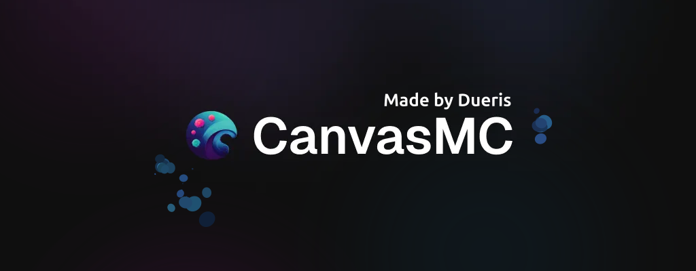

<div align="center">

[](https://github.com/CraftCanvasMC/Canvas/blob/master/LICENSE)
[](https://github.com/CraftCanvasMC/Canvas/graphs/contributors)
[](https://canvasmc.io/discord)

**CanvasMC** is a fork of the Folia Minecraft server software that fixes gameplay inconsistencies, bugs, and introduces further performance enhancements to the dedicated server.

Canvas pulls some patches from [Leaf](https://github.com/Winds-Studio/Leaf) to assist in single-threaded performance, along with a ton of our own performance patches
</div>

---

## Useful Links

- [Website](https://canvasmc.io)
- [Documentation](https://docs.canvasmc.io)
- [Discord](https://canvasmc.io/discord)

---

## Running Canvas

### Downloading the Server Jar

You can download the latest release from the [Downloads Page](https://canvasmc.io/downloads).

---

## Building Canvas

### Requirements

- Java 22 or higher
- Git (configured with name and email)
- Gradle

### Common Scripts

```bash
./gradlew applyAllPatches         # Apply all patches
./gradlew buildMojmapPublisherJar # Build the server jar
./gradlew runDevServer            # Run dev server
./rebuildPatches                  # Custom script to generate patches for modified directories
````

---

## Using the API (Gradle)

You can use the Canvas API in your own plugins via the following Gradle configuration:

<details>
<summary><code>build.gradle.kts</code></summary>

```kotlin
repositories {
    maven {
        name = "Canvas" // contains Canvas artifacts
        url = uri("https://maven.canvasmc.io/snapshots")
    }
    mavenCentral() // for other dependencies
    maven("https://repo.papermc.io/repository/maven-public/")
}

dependencies {
    implementation("io.canvasmc.canvas:canvas-api:1.21.8-R0.1-SNAPSHOT")
}
```

</details>

---

## REST API

Canvas exposes a REST API that allows you to retrieve builds and version information.

Temporary docs are available [here](https://github.com/CraftCanvasMC/Website/blob/main/docs/API.md) — these will soon be moved to the official documentation site.

---

## Support & Contribution

Help CanvasMC grow by:

* Supporting us on [Ko-fi](https://ko-fi.com/dueris)
* Starring the project on GitHub
* Contributing code or improving documentation

Your support helps keep the project active and evolving!

---

## License

Canvas is licensed under the [GPL-3.0](https://github.com/CraftCanvasMC/Canvas/blob/HEAD/LICENSE).

---
